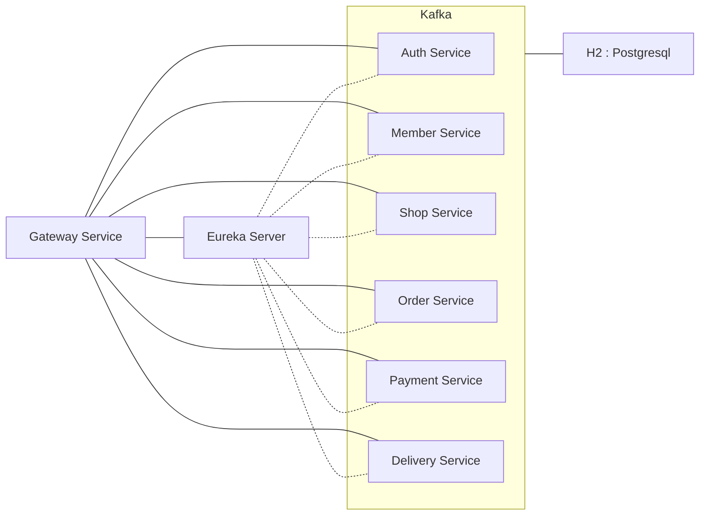

# Bob Backend API Server
## Description
This is the API server for the Bob project. <br/>
Bob can customize the taste and quantity of food. And Bob can donate the money saved to the charity. <br/>

## Spec
- JAVA 17
- Spring Boot 3.1.5
- Spring Cloud 2022.0.4
- Spring Cloud Netflix Eureka Server
- Spring Cloud Gateway
- Spring Cloud Stream Kafka Binder 3.1.5
- H2 Database : PostgreSQL
- Open API Swagger 3.0.0

## API Spec
### Auth Service
- Create Token
- Refresh Token
### Member Service
- Create Member
- Get Member
- Update Member
- Delete Member
### Shop Service
- Get Shop List
- Get Shop Menu List
### Order Service
- Create Receipt
- Get Order Menu History List
- Get Order Menu Detail
### Payment Service
- Pay
- Get Payment History List
- Get Payment History Detail
### Delivery Service
- Get Delivery Status
- Get Delivery History List

## API Architecture


## How to run
### Run with Application
```shell
$ docker-compose up -d
```