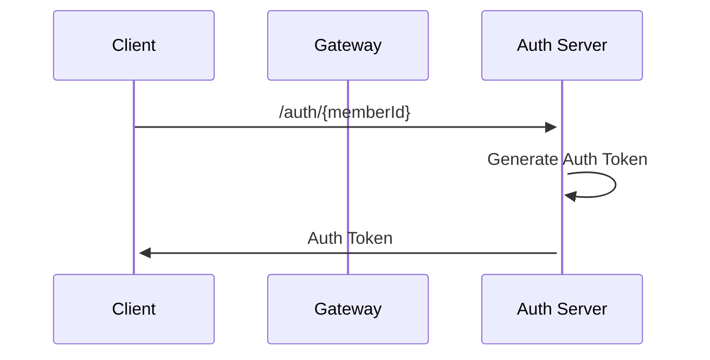
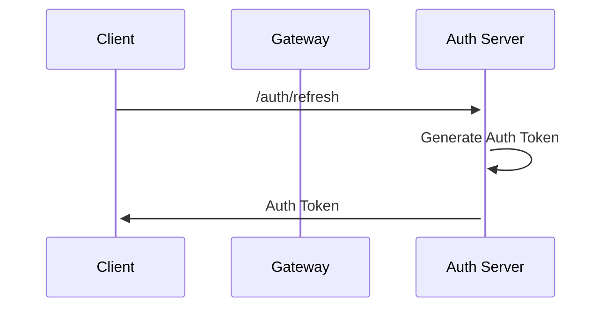

# Bob Auth Service

## Description

This is the Auth server for the Bob project.

## Spec

- JAVA 17
- Spring Boot 3.1.5
- Spring Cloud 2022.0.4
- JWT

## Environment Variables

| Name                          | Description                     | Default   |
|-------------------------------|---------------------------------|-----------|
| APP_PORT                      | The port the server will run on | 8081      |
| EUREKA_HOST                   | The host of the Eureka server   | localhost |
| EUREKA_PORT                   | The port of the Eureka server   | 8761      |
| JWT_SECRET                    | The secret key for JWT          | bob       |
| JWT_TOKEN_EXPIRATION_IN_HOURS | The expiration time of JWT      | 24        |

## Sequence Diagram

### 1. Create Auth Token

### 2. Refresh Auth Token

