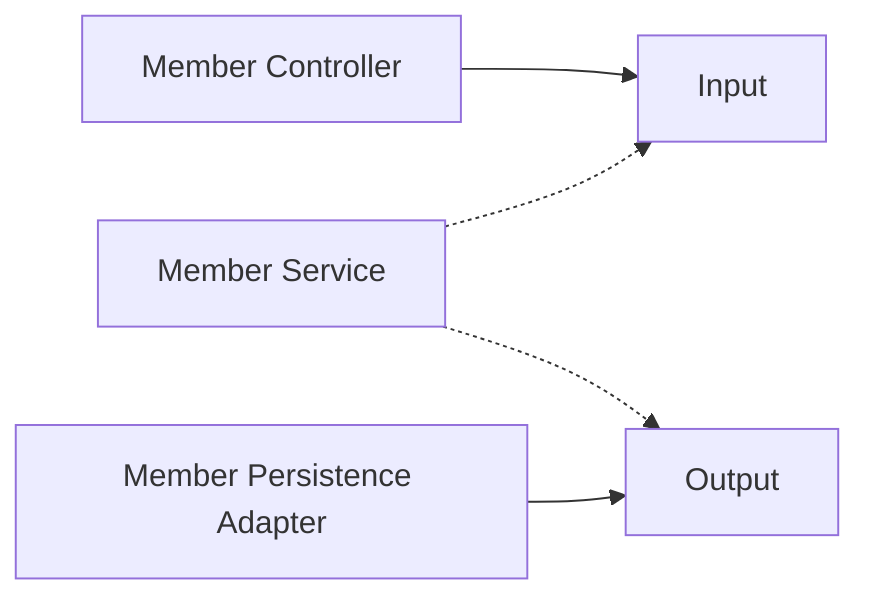
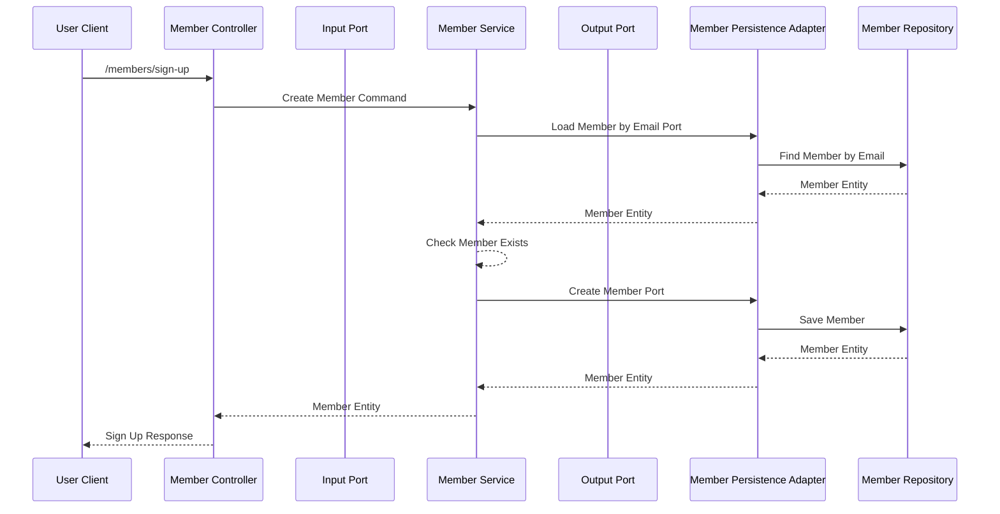
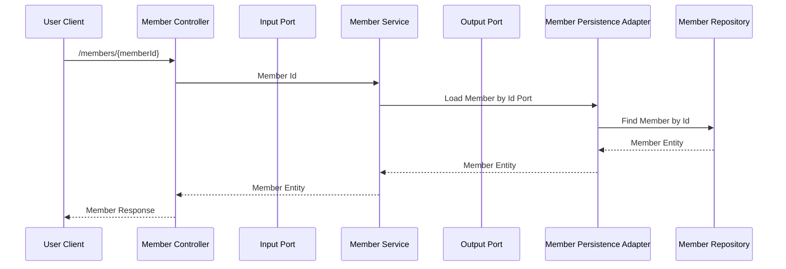
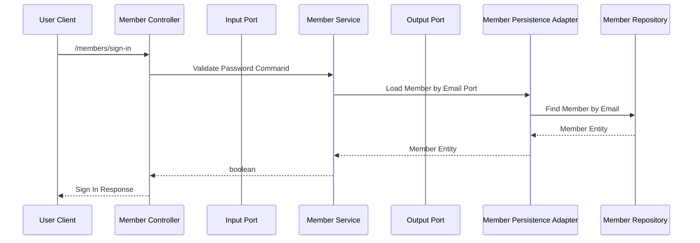

# Bob Member Service

## Description

This is the Member Service for the Bob project. It is a Spring Boot application that uses the Spring Cloud Netflix
Eureka
Server designed be hexagonal architecture.

## Spec

- JAVA 17
- Spring Boot 3.1.5
- Spring Cloud 2022.0.4
- Spring Cloud Netflix Eureka Server
- H2 Database : PostgreSQL
- Spring Data JPA
- QueryDSL

## Environment Variables

| Name        | Description                     | Default   |
|-------------|---------------------------------|-----------|
| APP_PORT    | The port the server will run on | 8082      |
| APP_PROFILE | The profile of the server       | local     |
| DB_URL      | The url of the database         | localhost |
| DB_NAME     | The name of the database        | bob       |
| DB_USERNAME | The username of the database    | bob       |
| DB_PASSWORD | The password of the database    | bob       |
| EUREKE_HOST | The host of the eureka server   | localhost |
| EUREKE_PORT | The port of the eureka server   | 8761      |

## Architecture

## Sequence Diagram

### 1. Sign Up

### 2. Get Member by Id

### 3. Sign In

